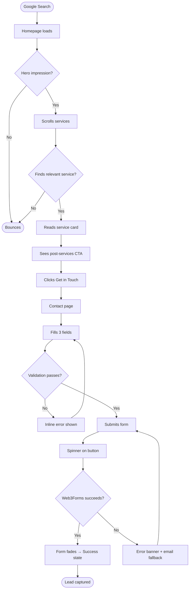
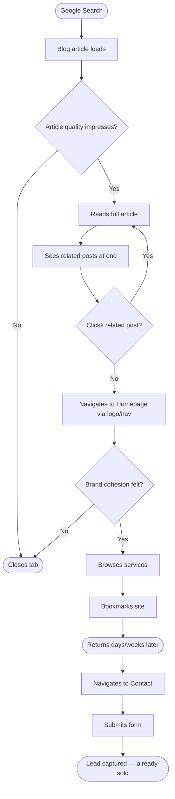
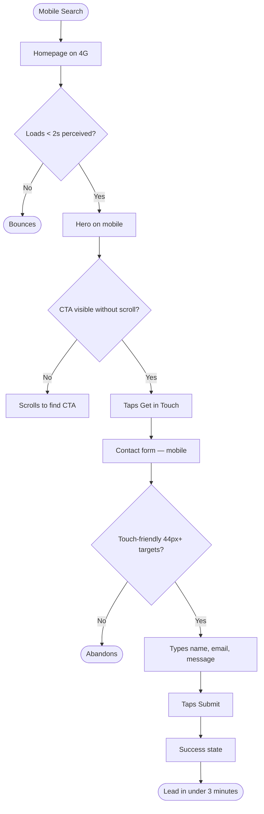
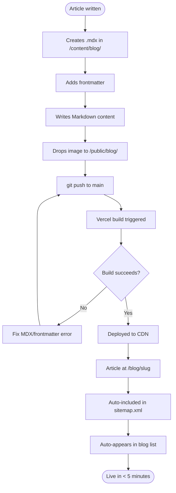

# UX Design Specification — The Brilliance Corner

**Author:** Hodayfa
**Date:** 2026-03-07

---

## Executive Summary

### Project Vision

The Brilliance Corner is a premium digital marketing agency website that exists as **proof of its own service offering.** It doesn't just describe world-class copywriting, social media, and SEO — it *demonstrates* them. The site is the agency's highest-value sales asset: the first thing a sceptical, high-ticket prospect will judge. It must communicate premium authority within 5 seconds, convert in 3 clicks, and outperform competitor sites on every measurable axis (speed, design, SEO, readability).

**Core tension the UX must resolve:** Luxury aesthetic vs. performance budget. The design must feel like a high-fashion editorial — but render in under 2.5s on 4G mobile.

### Target Users

| Persona | Device | Mindset | Primary Goal |
|---|---|---|---|
| **Karim** — SaaS founder | Desktop, 11pm | Intent-driven, time-poor, high-trust-threshold | Evaluate agency, submit contact form |
| **Nadia** — E-commerce skeptic | Desktop | Burned by past agencies, research-mode | Read blog, build trust over time |
| **Tariq** — Local business owner | Mobile, on the go | Impulsive action, needs simplicity | Find + contact agency fast |
| **Hodayfa** — Content author | VS Code | Zero-friction publishing workflow | Drop MDX file, see it live |

**Critical UX insight:** There are no casual browsers here. Every visitor either (a) arrived from a targeted search with commercial intent, or (b) was drawn in by a blog article. The design must serve high-intent, analytical users — not entertain low-attention scrollers.

### Key Design Challenges

1. **Authority without social proof.** No portfolio, no testimonials at launch. The design itself — typography, spacing, motion, copy quality — must do the trust-building work. Every pixel is a proof point.

2. **Animation richness vs. Core Web Vitals.** Framer Motion entrance + scroll animations are non-negotiable brand requirements. But they must be architected to never block LCP, cause CLS, or slow INP. This demands strict animation budgeting: `opacity` + `translateY` only, no layout-affecting properties, `will-change` used surgically.

3. **Mobile-first luxury.** "Premium" design historically defaults to wide, white-space-heavy desktop layouts. On a 390px screen, this either collapses into mediocrity or requires a completely deliberate mobile design system — not just a responsive reflow.

4. **Blog–brand cohesion.** Nadia's journey depends on the blog feeling like an extension of the main site, not a bolted-on CMS. Typography system, spacing tokens, and component language must be identical across all routes.

### Design Opportunities

1. **The site as the portfolio.** With no case studies available, the site's own visual execution becomes the case study. A first-time visitor who sees flawless typography, purposeful motion, and pixel-perfect layout on mobile has already seen the agency's work.

2. **Surgical motion as a differentiator.** Most agency sites either over-animate (cheap and distracting) or under-animate (generic). A minimal, confident animation vocabulary — slow fades, precise Y-axis reveals, no bounce — can signal taste and expertise instantly.

3. **Blog as authority accelerator.** The file-based MDX system means Hodayfa can publish at the speed of thought. If the reading experience is exceptional (typography, line length, estimated read time, related posts), Nadia's research journey becomes a loyalty loop.

4. **Contact as closure, not friction.** A minimal 3-field form (name, email, message) with an immediate, warm confirmation state is rare in the agency world. That frictionlessness is itself a conversion signal: *"This agency respects my time."*

---

## Core User Experience

### Defining Experience

**The ONE core action:** A high-intent visitor landing on the homepage reads the hero, scrolls through services, and submits the contact form — all within a single, uninterrupted forward motion. Every design decision either accelerates or defers this path. Nothing should create lateral gravity.

**What must be absolutely effortless:**
- Understanding the agency's value proposition in the first viewport (no scroll required)
- Finding the contact form from any page in a single click
- Completing and submitting the contact form on mobile with one thumb

**What must be completely invisible (zero cognitive load):**
- Navigation — always accessible, never intrusive
- Animation — enhances without distracting; users shouldn't notice it, they should *feel* it
- Form validation — inline, immediate, non-blocking

### Platform Strategy

| Platform | Priority | Design Approach |
|---|---|---|
| Mobile (< 640px) | Primary | Designed first; full visual quality, not a stripped-down fallback |
| Desktop (> 1024px) | Primary | Wider canvas used for breathing room and typographic scale, not more content |
| Tablet (640–1024px) | Secondary | Graceful bridge — same components, adjusted grid |
| Touch input | Primary | 44px minimum targets; swipe-friendly blog navigation |
| Keyboard/mouse | Secondary | Full focus management; hover states as progressive enhancement |

No offline functionality required. Static CDN delivery via Vercel makes this a non-issue — pages load from cache near-instantly on repeat visits.

### Effortless Interactions

1. **Zero-scroll CTA.** The hero CTA is visible and tapable without scrolling on every device. No hunting.

2. **Navigation that disappears when you're reading.** On blog posts: nav hides on scroll-down, reappears on scroll-up. Users get full reading width without nav chrome polluting the experience.

3. **Contact form — 3 fields, autofocus, no CAPTCHA.** Name, email, message. Web3Forms handles everything. Submit → instant confirmation. Done.

4. **Blog post reading.** Estimated read time in the card. Related posts surfaced at the end — Nadia never has to navigate back to the list.

5. **Animations that never make you wait.** Every Framer Motion transition is under 600ms. No animation delays a content reveal by more than 200ms. The user is always reading before the motion finishes.

### Critical Success Moments

| Moment | Why It's Make-or-Break |
|---|---|
| **First 3 seconds of the hero** | Karim decides whether to scroll or close. Headline + subhead + CTA must be flawless. |
| **Services section scan** | The moment a visitor maps their problem to an agency service. If this mapping fails, they bounce. |
| **Contact form submission confirmation** | The last impression. Warm, specific, reassuring copy converts anxiety to confidence. |
| **First blog article load (from search)** | Nadia's entry point. Cheap or slow = agency credibility shattered. |
| **Mobile homepage load on 4G** | Tariq's moment of truth. Sub-2s perceived load or he's gone. |

### Experience Principles

1. **Authority is earned through execution, not claimed through copy.** The design quality is the proof. Spacing, type, motion — all decisions must be defensible as premium.

2. **Forward motion only.** Every page, section, and interaction should pull the visitor toward the next step. Dead ends and unclear hierarchy kill momentum.

3. **Performance is a design value.** Speed is not a technical afterthought — it is a direct communication of professionalism.

4. **Mobile is not a fallback — it is the primary canvas.** Every design decision is made on mobile first, then scaled up.

5. **Motion earns its place or it doesn't exist.** Every animation must either aid comprehension or reinforce brand tone. Decoration-only animations are removed.

---

## Desired Emotional Response

### Primary Emotional Goals

The single emotional north star for every visitor interaction with The Brilliance Corner:

**"I've found the agency I've been looking for."**

This is the feeling of recognising quality without being able to articulate exactly why — what happens when a premium brand's site loads and you feel, before reading a word, that this is serious. That's the target.

Supporting emotional responses:
- **Confidence** — *"This agency knows what they're doing."* Established within the first viewport.
- **Calm** — *"I don't feel sold to."* The design is confident, not aggressive. No pop-ups, no urgency timers, no fake social proof.
- **Respect** — *"They respect my intelligence."* Copy is specific, not generic. Design is precise, not decorated.

### Emotional Journey Mapping

| Stage | Desired Emotion | Design Trigger |
|---|---|---|
| **First landing (hero)** | Impressed → Curious | Flawless typography, purposeful whitespace, a headline that earns attention |
| **Scrolling services** | Recognised → Hopeful | Benefit-led copy, no jargon — "this describes my problem exactly" |
| **Reading a blog article** | Engaged → Trusting | Long-form quality, clean reading environment, useful insight |
| **Navigating to contact** | Decisive → Ready | One click, clear path, no re-selling required |
| **Submitting the form** | Relieved → Satisfied | Immediate warm confirmation — "We'll be in touch within 24 hours" |
| **Error / validation** | Mildly corrected (not frustrated) | Inline, gentle, specific error messages — never blocking, never condescending |
| **Return visit** | Familiar → Loyal | Consistent brand experience; no visual surprises |

### Micro-Emotions

| Target Micro-Emotion | Avoid |
|---|---|
| Confidence (I'm in the right place) | Confusion (What does this agency do?) |
| Trust (This is credible) | Skepticism (Too good to be true) |
| Calm focus (I can read clearly) | Anxiety (Too much going on) |
| Accomplishment (I submitted my inquiry) | Frustration (The form is complicated) |
| Subtle delight (That animation was satisfying) | Irritation (Make it stop) |

The emotional register targets *satisfaction* — the feeling of a perfectly balanced object in your hand. Delight from craft, not from novelty.

### Design Implications

| Emotion Target | UX Design Approach |
|---|---|
| **Impressed on arrival** | Hero uses large-scale display type, maximum whitespace, one focused headline. No cluttered above-the-fold. |
| **Calm, not sold to** | No sticky banners, no chat widgets, no exit-intent overlays. CTAs appear where they're earned. |
| **Trust through specificity** | Service descriptions name real outcomes. Blog articles cite specifics. |
| **Confidence during form submission** | Labels always visible (not placeholder-only). Submit button clearly labeled. Success state is warm and human. |
| **Subtle delight from motion** | Framer Motion uses `easeOut`. Enter animations reveal content as if it was always there, not as performance. |
| **No anxiety on mobile** | Full-size tap targets. No horizontal scroll. No zoom required. Navigation collapses cleanly. |

### Emotional Design Principles

1. **Earn attention before asking for it.** Impressiveness comes first; conversion comes second.

2. **Calm is a premium signal.** Restraint signals abundance. Every removed element is a statement of confidence.

3. **Specificity builds trust; vagueness destroys it.** Every generic word costs credibility. Every specific claim builds it.

4. **Micro-interactions are emotional punctuation.** Hover states, form field focus, confirmation copy — these compound into a feeling of being looked after.

5. **The absence of friction is itself an emotion.** When everything works without thinking, users feel respected. That transfers to the brand.

---

## UX Pattern Analysis & Inspiration

### Inspiring Products Analysis

**1. Linear (linear.app)**
The benchmark for modern B2B design. Key lessons:
- Near-black base (#0F0F0F) communicates seriousness and technical precision
- Typography hierarchy through size and spacing alone — one weight does most of the work
- Scroll-triggered reveals are surgical: content appears exactly when needed, never before
- Hero headline is a complete thought — direct, confident, specific
- **Transferred:** "Less chrome, more content." The confidence to use aggressive empty space.

**2. Stripe (stripe.com)**
Gold standard for premium B2B trust-building without portfolio dependency:
- Establishes credibility through design quality and copy precision, not social proof alone
- Section rhythm is precise: every section has one job, one headline, one supporting sentence
- CTAs never feel desperate — they appear naturally at the end of a convincing argument
- **Transferred:** The section-as-argument structure. Each scroll reveals one persuasive beat.

**3. Lusion / Basement Studio (award-winning agency sites)**
Premium agency sites using motion as a primary brand signal:
- Motion used as editorial punctuation — slow reveals, no bounce, absolute confidence
- Typography is the hero: massive weights, unusual scale relationships
- Whitespace is aggressive and intentional — gaps that feel expensive
- **Transferred:** Treating whitespace as a luxury material. Restraint in animation timing.

**4. The Verge / Stripe Press (editorial blog references)**
Best-in-class long-form digital reading experiences:
- Line length capped at 65–70ch — never causes eye fatigue
- Article body at 18–20px with a reading-optimised serif or humanist sans
- Related content appears as natural continuation, not as an exit trap
- **Transferred:** Reading column spec. The related-posts-as-continuation pattern.

### Transferable UX Patterns

**Navigation Patterns:**
- Minimal fixed nav — logo left, 3–4 links center/right, single CTA button. Hides on blog scroll, reappears on scroll-up.
- No hamburger on desktop — all primary navigation visible at all times on ≥ 1024px.
- Mobile: full-screen overlay nav — opens with fade/slide, closes with tap outside.

**Interaction Patterns:**
- Scroll-reveal stagger — heading fades in first (+0ms), body follows (+100ms), CTA follows (+200ms).
- CTA hover: underline draw + subtle lift — no scale, no color flash. Confident, not eager.
- Form field focus: border colour transition from neutral to brand accent. Instant, undramatic.
- Success state replacement — form fades and is replaced by confirmation text. Resolved, not abrupt.

**Visual Patterns:**
- Dark-dominant palette — near-black base, one warm accent, neutral greys for hierarchy.
- Large editorial type on hero — display heading at 64–96px desktop, 36–48px mobile.
- Section dividers via whitespace only — no lines, no borders.
- Blog cards: cover image, title, date, read time. No excerpt. No visible tags on card.

### Anti-Patterns to Avoid

1. **Logo grid above the fold** — every mediocre agency leads with this. TBC has none at launch, which is an advantage if design is strong enough.
2. **Auto-playing hero videos** — immediate LCP killer, looks cheap on slow connections.
3. **Oversaturated gradient backgrounds** — purple-to-pink signals "startup template," not premium agency.
4. **Sticky chat widgets** — contradicts calm, confident emotional register.
5. **Bounce-eased animations** — `spring` with high bounce = playful startup. TBC needs `easeOut`.
6. **Placeholder-only form labels** — context disappears on focus; always use persistent labels.
7. **Blog body font under 16px** — a premium site that makes you squint is self-defeating.

### Design Inspiration Strategy

**Adopt directly:**
- Linear's near-black base and aggressive whitespace philosophy
- Stripe's section-as-argument scroll structure
- Reading column spec: 65–70ch max, 18px+ body, line-height 1.7–1.8
- Scroll-reveal stagger with 100ms offsets — heading → body → CTA

**Adapt for TBC:**
- Linear's type scale is tech-coded — adapt to a warmer editorial pairing (display serif + clean sans) fitting the agency/creative space
- Stripe's gradients are complex — simplify to flat near-black with a single warm accent
- Lusion's motion philosophy adopted; WebGL complexity left behind

**Avoid entirely:**
- Generic agency template patterns (Webflow Showcase-style grids, diagonal section dividers)
- Oversaturated brand palettes
- SaaS UI patterns (dashboards, toggles, tabs) — wrong context

---

## Design System Foundation

### Design System Choice

**Custom Design System built on Tailwind CSS design tokens.**

No third-party component library. Pure Tailwind CSS with a fully custom token layer, hand-crafted React components, and Framer Motion variants.

### Rationale for Selection

| Factor | Why Custom Tailwind Wins |
|---|---|
| **Stack is already Tailwind** | PRD explicitly specifies Tailwind CSS. A component library adds bundle weight and fights the stack. |
| **Premium visual uniqueness** | MUI, Chakra, Ant Design are immediately recognisable. TBC must not look like a template. |
| **Performance (Lighthouse 90+)** | Component libraries ship unused JS/CSS. Tailwind's purge produces the smallest possible CSS. Zero component library JS. |
| **Solo developer** | Tailwind's utility-first approach is optimised for solo developers — no design system maintenance overhead. |
| **Full motion control** | Framer Motion variants must be authored precisely. Component library abstractions interfere with animation composition. |
| **Accessibility** | Implemented directly via semantic HTML + ARIA. No library abstraction to debug. |

### Implementation Approach

The design system lives entirely in `tailwind.config.ts` as extended tokens, plus a small set of hand-crafted React components.

**Token Architecture:**

```
tailwind.config.ts
├── colors          → Full brand palette (bg, text, border, accent)
├── fontFamily      → Display serif + UI sans (via next/font)
├── fontSize        → Named scale (display, h1–h4, body-lg, body, small, caption)
├── fontWeight      → Constrained set (400, 500, 700)
├── lineHeight      → Reading (1.75) + Display (1.1) + UI (1.4)
├── letterSpacing   → Display (-0.03em) + UI (0) + Caps (0.1em)
├── spacing         → Extended scale (section, container, component gaps)
├── borderRadius    → Minimal (sm: 4px, md: 8px, lg: 16px, full)
└── transitionDuration → Animation budget tokens (fast: 150ms, base: 300ms, slow: 500ms)
```

**Component Inventory:**

| Component | Notes |
|---|---|
| `Button` | Primary, Ghost, Text variants — all with Framer Motion hover |
| `Nav` | Fixed, scroll-aware hide/show on blog routes |
| `HeroSection` | Full-viewport, entrance animated |
| `ServiceCard` | Scroll-reveal, icon + headline + body |
| `BlogCard` | Cover image, title, date, read time |
| `BlogPostLayout` | Reading column, prose styles, related posts |
| `ContactForm` | 3 fields, Web3Forms, success state |
| `Footer` | Links, social, contact info |
| `AnimateIn` | Reusable Framer Motion wrapper for scroll-reveal |
| `SectionWrapper` | Consistent section padding + max-width container |

### Customization Strategy

**Colour tokens** defined once in `tailwind.config.ts`, never hardcoded. All component classes reference semantic token names (`bg-surface`, `text-primary`, `border-subtle`, `text-accent`).

**Typography** handled by two `next/font` instances in `layout.tsx`, exposed as CSS variables, consumed in `tailwind.config.ts` — zero FOUT, zero CLS, zero external font requests.

**Framer Motion variants** authored in a shared `animations.ts` constants file. All enter/exit transitions reference named variants (`fadeUp`, `fadeIn`, `staggerContainer`). No animation logic in component files.

---

## 2. Core User Experience

### 2.1 Defining Experience

The defining experience for The Brilliance Corner:

> *"A high-intent prospect arrives, reads a confident headline, understands exactly what the agency does and who it's for, and submits a contact inquiry — all within one forward scroll, no lateral navigation required."*

This is not a product with a complex core loop. It's a **trust conversion path**. The defining experience is the seamless *absence of friction* across the entire path from hero to form submission. The experience succeeds when a visitor doesn't consciously notice they're being led anywhere.

**The three moments that define this experience:**
1. The hero headline lands before the user decides to scroll
2. The services section maps their problem to a service without effort
3. The form submits and confirms without anxiety

If all three land, the agency gets the lead. If any one fails, the path breaks.

### 2.2 User Mental Model

**What users bring when they land:**

Karim and Tariq arrive with a specific mental model from past agency experiences:
- *"Agency sites are all the same — generic copy, stock photos, contact forms that go nowhere"*
- *"I need to evaluate credibility fast before I waste time on a call"*
- *"The quality of the site tells me the quality of the work"*

Nadia brings a different model:
- *"I'm here to learn, not to be sold to"*
- *"If the content is genuinely useful, I'll consider the agency behind it"*
- *"A brand that publishes intelligently about SEO probably understands SEO"*

**Design implications:**
- The hero must immediately contradict the "same as everyone else" expectation — through visual quality, not claims
- Service descriptions must answer "is this for me?" before the visitor has to ask
- The blog must feel like journalism, not content marketing
- The contact path must feel like the visitor's decision, not the agency's funnel

**Where users get frustrated with competitors:**
- Generic copy ("we're passionate about results") creates confusion because it matches every competitor
- Over-long service pages with no clear outcome lose the scan-first reader
- Contact forms with excessive fields (budget range, project timeline) signal sales qualification, not conversation

### 2.3 Success Criteria

| Criterion | Measurable Signal |
|---|---|
| Value understood in first viewport | No scroll required to grasp "premium digital marketing agency for high-growth businesses" |
| Service relevance felt within 30 seconds | User pauses on at least one service card and reads below the headline |
| Contact path found without hunting | CTA reachable from any page in exactly one click |
| Form completed without hesitation | 3 fields, clear labels, no ambiguous inputs |
| Submission confirmed immediately | Success state visible within 1s of submit; no loading limbo |
| Mobile experience indistinguishable from desktop | Same visual quality, same forward path, same confidence |

### 2.4 Novel vs. Established Patterns

**Verdict: Established patterns, executed with exceptional craft.**

TBC does not need novel UX patterns — it needs *familiar* patterns executed at a level above every competitor. Navigation, hero scroll path, and contact form are all established conventions the target users already understand.

**The innovation is in the execution:**
- The same nav pattern with perfect spacing, weight, and scroll behaviour
- The same hero pattern with a headline that earns attention on its own
- The same form pattern with labels that never disappear and a warm confirmation state

**One deliberate deviation:** Hide-on-scroll nav on blog routes. A proven pattern (Medium, Stripe Press) but unusual in the agency space. Worth it because it directly serves Nadia's reading experience — and a visitor who reads deeply is already sold.

### 2.5 Experience Mechanics

**The complete conversion path — step by step:**

**1. Initiation — Hero**
- Trigger: Page load
- User sees: Full-viewport dark canvas, large display headline, single-sentence subhead, one CTA button
- System: Entrance animation — headline fades in (0ms delay, 600ms), subhead follows (150ms), CTA follows (300ms)
- User action: Reads, decides to scroll

**2. Interaction — Services Scroll**
- Trigger: User scrolls past hero fold
- User sees: "What We Do" heading scroll-reveals, three service cards stagger in
- Each card: Icon → Service name → Outcome statement → "Learn more" link
- System: Each card entrance is viewport-triggered, not page-position-triggered
- User action: Scans, reads the card matching their situation

**3. Feedback — CTA Arrives Naturally**
- Bottom of Services: "Ready to transform your digital presence?" + "Get in Touch" button
- CTA appears after the user has received value from the services description — not pushed, earned

**4. Contact Form**
- Trigger: User clicks any "Get in Touch" CTA
- User sees: Clean page — headline, 3 labelled fields (Name, Email, Message), submit button
- Validation: Inline, on-blur — red border + specific error text below field. Never blocking.
- Submit: Button shows spinner (disabled), then...

**5. Completion**
- Success: Form fades out (300ms), replaced by checkmark icon + *"Message received."* + *"We'll review your inquiry and be in touch within 24 hours."*
- Error: Form stays visible, banner above submit: *"Something went wrong. Please try again or email us directly at [email]."*
- No redirect, no page reload, no ambiguity

---

## Visual Design Foundation

### Color System

**Decision: Dark luxury palette — near-black dominant, warm gold accent, structured neutral scale.**

The emotional targets (confidence, calm, authority) combined with the Linear/Stripe inspiration point to a dark-mode-first palette. Light agency sites read as approachable and generic. Dark reads as serious, selective, and premium.

**Full Palette:**

| Token | Hex | Role |
|---|---|---|
| `--color-bg` | `#0A0A0A` | Page background — true near-black, not pure black (avoids harsh contrast) |
| `--color-surface` | `#111111` | Card backgrounds, nav background |
| `--color-surface-raised` | `#1A1A1A` | Hover states, elevated surfaces |
| `--color-border` | `#2A2A2A` | Subtle dividers, input borders at rest |
| `--color-border-focus` | `#C9A84C` | Input border on focus — accent bleeds in |
| `--color-text-primary` | `#F5F0E8` | Primary text — warm white, not pure #FFFFFF |
| `--color-text-secondary` | `#9A9690` | Secondary/supporting text, labels, metadata |
| `--color-text-muted` | `#5A5755` | Placeholder text, disabled states |
| `--color-accent` | `#C9A84C` | Gold accent — CTAs, active states, decorative details |
| `--color-accent-hover` | `#DEC06A` | Accent on hover — lighter, not brighter |
| `--color-accent-subtle` | `#C9A84C1A` | 10% opacity accent — subtle highlights, tag backgrounds |
| `--color-success` | `#4A9E7F` | Form success state — muted teal, not garish green |
| `--color-error` | `#C0544A` | Form error state — muted red, not alarming |

**Rationale for gold accent:**
Gold communicates premium/luxury without the visual aggression of red or coldness of blue. Warm gold against near-black is a timeless luxury combination (high-end watches, premium fashion, financial services). Distinctive in the agency space where competitors default to purple, teal, or electric blue.

**Semantic Tailwind mapping:**
```js
colors: {
  bg: '#0A0A0A',
  surface: '#111111',
  'surface-raised': '#1A1A1A',
  border: { DEFAULT: '#2A2A2A', focus: '#C9A84C' },
  text: { primary: '#F5F0E8', secondary: '#9A9690', muted: '#5A5755' },
  accent: { DEFAULT: '#C9A84C', hover: '#DEC06A', subtle: '#C9A84C1A' },
  success: '#4A9E7F',
  error: '#C0544A',
}
```

### Typography System

**Decision: Playfair Display (display/headings) + Inter (UI/body) — editorial luxury pairing.**

| Role | Font | Rationale |
|---|---|---|
| **Display / Hero headings** | Playfair Display | High-contrast serif — hallmark of editorial luxury. Thick/thin stroke variation creates visual richness at large scale. Signals authority. |
| **UI / Body / Navigation** | Inter | Cleanest, most readable humanist sans at small sizes. Neutral enough not to fight the display type. Used by Linear, Vercel, Stripe. |

**Type Scale:**

| Token | Size | Line Height | Letter Spacing | Weight | Use |
|---|---|---|---|---|---|
| `text-display` | `clamp(3rem, 6vw, 6rem)` | 1.05 | -0.03em | 700 | Hero headlines |
| `text-h1` | `clamp(2rem, 4vw, 3.5rem)` | 1.1 | -0.02em | 700 | Page titles |
| `text-h2` | `clamp(1.5rem, 2.5vw, 2.25rem)` | 1.2 | -0.01em | 600 | Section headings |
| `text-h3` | `clamp(1.125rem, 2vw, 1.5rem)` | 1.3 | 0 | 600 | Card titles, subsections |
| `text-h4` | `1.125rem` | 1.4 | 0.01em | 500 | Small headings, labels |
| `text-body-lg` | `1.125rem` | 1.75 | 0 | 400 | Blog body, service descriptions |
| `text-body` | `1rem` | 1.65 | 0 | 400 | General UI text |
| `text-small` | `0.875rem` | 1.5 | 0.01em | 400 | Metadata, dates, read time |
| `text-caption` | `0.75rem` | 1.4 | 0.05em | 500 | Labels, tags, nav items |

**Font loading (`layout.tsx`):**
```tsx
const playfair = Playfair_Display({
  subsets: ['latin'], weight: ['700'],
  variable: '--font-display', display: 'swap',
})
const inter = Inter({
  subsets: ['latin'], weight: ['400', '500', '600'],
  variable: '--font-ui', display: 'swap',
})
```

**Blog prose:** Inter 18px, line-height 1.8, max-width 68ch. Headings in blog use Playfair Display for visual continuity. `@tailwindcss/typography` prose plugin with full dark-mode override to match colour tokens.

### Spacing & Layout Foundation

**Spacing unit: 4px base (Tailwind default). Extended with semantic section tokens.**

**Container system:**

| Property | Value |
|---|---|
| Max content width | 1200px |
| Max reading width (blog) | 720px |
| Section padding X | `clamp(1.5rem, 5vw, 6rem)` |
| Section padding Y | `clamp(4rem, 8vw, 8rem)` |

**Extended spacing tokens:**
```js
spacing: {
  'section-sm': 'clamp(3rem, 6vw, 6rem)',
  'section': 'clamp(5rem, 10vw, 10rem)',
  'section-lg': 'clamp(7rem, 14vw, 14rem)',
  'container': 'clamp(1.5rem, 5vw, 6rem)',
}
```

**Grid system:**
- Desktop: 12-column, 24px gutters
- Tablet: 8-column, 16px gutters
- Mobile: 4-column, 16px gutters

**Component spacing rules:**
- Card internal padding: `p-6` desktop / `p-4` mobile
- Between cards: `gap-6` (24px)
- Between section headline and content: `mb-12` (48px)
- Between nav items: `gap-8` (32px) desktop

### Accessibility Considerations

**Contrast compliance (WCAG 2.1 AA):**

| Pair | Contrast Ratio | Status |
|---|---|---|
| `text-primary` on `bg` | ~18:1 | AAA |
| `text-secondary` on `bg` | ~7.2:1 | AAA |
| `accent` on `bg` | ~7.8:1 | AAA |
| `text-primary` on `surface` | ~17:1 | AAA |
| `text-muted` on `bg` | ~3.8:1 | AA large text only — used only for placeholders |

**Additional decisions:**
- Focus rings: `outline: 2px solid #C9A84C; outline-offset: 4px` — always visible, never hidden
- All Framer Motion animations suppressed when `prefers-reduced-motion: reduce` is active via `useReducedMotion()` hook
- Minimum tap target: 44×44px on all interactive elements
- Form labels: always visible above input, never placeholder-only

---

## Design Direction Decision

### Design Directions Explored

Six directions were generated and explored, all sharing the same typographic system (Playfair Display + Inter), component structure, and layout approach. The primary variable was colour treatment and accent strategy:

1. **Editorial Dark Gold** — `#0A0A0A` base, warm gold `#C9A84C` accent
2. **Noir Ivory** — `#080808` base, ivory `#EDE8DC`, no colour accent
3. **Deep Navy Gold** — `#08101A` deep navy base, gold accent
4. **High Contrast Minimal** — Pure `#000000`, white only, no accent
5. **Dark Warm Texture** — `#0C0B09` with subtle noise overlay, gold accent
6. **Alternating Depth** — `#0A0A0A` ↔ `#0F0F0F` section alternation, outlined gold CTA

HTML showcase saved at: `_bmad-output/planning-artifacts/ux-design-directions.html`

### Chosen Direction

**Direction 1: Editorial Dark Gold**

- Background: `#0A0A0A` (near-black, not pure black)
- Primary accent: `#C9A84C` (warm gold)
- Text: `#F5F0E8` (warm white)
- Secondary text: `#9A9690`
- Surface: `#111111`
- Typography: Playfair Display 700 (display) + Inter 400/500/600 (UI)
- CTA style: Solid gold fill with dark text — unambiguous, highest-converting on dark backgrounds

### Design Rationale

Gold against near-black is the most direct visual translation of the PRD brand brief — *"luxurious, minimal, sharp, uncompromisingly confident."* It is the only accent in the agency space that reads as premium creative rather than tech startup or financial services clone. The near-black (vs. pure black) prevents visual harshness and allows subtle surface layering (`#111111`, `#1A1A1A`) to create depth without competing gradients. The warm white text (`#F5F0E8` vs. `#FFFFFF`) completes the warmth chain: every colour in the palette carries a slight warmth that reads as human, not sterile.

### Implementation Approach

Fully implemented as Tailwind CSS custom tokens in `tailwind.config.ts`. No colour hardcoded in components — all Tailwind classes reference semantic token names. Direction 1's token set is already defined in the Visual Design Foundation section above.

---

## User Journey Flows

### Journey 1: Karim — SaaS Founder (Primary Conversion Path)

**Entry:** Google search → Homepage → Services → Contact



**Key decisions:** Hero CTA visible without scroll. Services use outcome-first copy. Post-services CTA placed after value delivery. Form autofocuses Name field.

### Journey 2: Nadia — E-Commerce Skeptic (Blog-to-Trust Path)

**Entry:** Google search → Blog article → Homepage → Contact (days/weeks later)



**Key decisions:** Blog typography (18px, 68ch, 1.8 lh) must feel editorial premium. Related posts surfaced at article end. Hide-on-scroll nav on blog routes. Brand identity identical between blog and main site.

### Journey 3: Tariq — Mobile Local Business (Fast Mobile Path)

**Entry:** Mobile search → Homepage → Contact (under 3 minutes)



**Key decisions:** Hero CTA visible on all mobile viewports (375–430px). Form inputs min-height 52px. `inputmode="email"` on email field. No CAPTCHA.

### Journey 4: Hodayfa — Content Author (Publishing Path)

**Entry:** VS Code → git push → Live article



**Key decisions:** Required frontmatter: `title`, `publishedAt`, `description`, `slug`, `coverImage`, `tags`. Build fails loudly on missing required fields. No manual registry or database update required.

### Journey Patterns

**Navigation:** All external entry points reach destination in 0 navigation steps. Primary CTA reachable from every page in 1 click. Blog → Homepage always available via logo.

**Decision:** Each journey has one critical decision gate (hero impression, article quality, mobile load). No journey requires a product choice — only continue or leave. Form never presented before value delivered.

**Feedback:** All async operations show immediate state change (spinner). All success states are replacement-in-place — no redirect. All error states preserve user input.

**Error Recovery:** Form validation is inline, on-blur, field-specific. Submission error shows direct email fallback. Blog build error: Vercel dashboard notification with descriptive logs.

### Flow Optimization Principles

1. **Zero dead ends.** Every error state provides a clear next action.
2. **Preserve user intent through failures.** Form input never cleared on error.
3. **Fast paths for high-intent users.** Tariq's path requires 0 mandatory reading except the form itself.
4. **The blog is a parallel entry point, not secondary.** Every article page performs at homepage quality.
5. **Async operations must communicate.** Loading, success, and error states are non-negotiable.

---

## Component Strategy

### Design System Components

Custom Tailwind CSS token system (no component library). Zero pre-built components. Every component is hand-crafted on top of the token layer — giving complete visual control with zero bundle overhead.

### Custom Components

#### `<Nav>`
Fixed top navigation. `bg-surface/90` with backdrop blur. Blog routes: hides on scroll-down (`translateY(-100%)` 300ms), reappears on scroll-up. Mobile: full-screen overlay with fade/slide. `role="navigation"`, `aria-label="Main navigation"`. Mobile toggle: `aria-expanded`, `aria-controls`. Focus trapped in mobile menu when open.

#### `<Button>`
Three variants: `primary` (gold fill `bg-accent text-bg`) · `ghost` (`border-border text-secondary`) · `text` (no border, `text-accent` underline hover). States: default · hover · focus (gold ring) · disabled (40% opacity) · loading (spinner, `aria-busy="true"`). Framer Motion: `whileHover={{ y: -1 }}`, `easeOut` 150ms. No scale, no color flash.

#### `<HeroSection>`
`min-h-screen`, flex column, centered. Entrance animation sequence: eyebrow (0ms/600ms) → headline (150ms/700ms) → subhead (300ms/600ms) → CTA group (450ms/500ms). All `{ opacity: 0→1, y: →0 }`, `easeOut`. Reduced motion: `opacity` only, 200ms, no Y movement.

#### `<ServiceCard>`
Icon glyph · h3 title · outcome statement · "Learn more" text link. Scroll-reveal stagger: card 1 +0ms, card 2 +100ms, card 3 +200ms. `{ opacity: 0→1, y: 32→0 }`, 600ms, `easeOut`, `useInView` `once: true`. Mobile: full-width stacked, no stagger.

#### `<BlogCard>`
Cover image (16:9, `next/image` with blur placeholder) · date · read time · title. No excerpt — title earns the click. Hover: title → `text-accent`, image `scale(1.02)`. Explicit `width`/`height` always provided — zero CLS.

#### `<BlogPostLayout>`
Article header (title, date, read time, tags) · prose column (68ch max, Inter 18px, lh 1.8) · related posts (3 cards) · back-to-blog link. Headings in prose use Playfair Display. `@tailwindcss/typography` prose with full dark-mode override. Hide-on-scroll nav activated on this layout only.

#### `<ContactForm>`
3 fields: Name (autofocus, required ≥2 chars) · Email (`inputmode="email"`, valid format) · Message (5 rows, required ≥10 chars). Validation: on-blur, field-specific, inline. Submit: spinner + disabled. Success: `AnimatePresence` fades form out (300ms), fades in checkmark + "Message received." + "24h response." Error: form stays, banner above submit with direct email fallback. Labels always above input — never placeholder-only. `aria-describedby` connects errors to fields. `aria-live="polite"` for success/error announcements.

#### `<AnimateIn>` (utility)
Reusable scroll-reveal wrapper. Props: `delay` (ms), `once` (bool, default `true`), `amount` (0–1, default 0.2). Triggers `{ opacity: 0→1, y: 24→0 }` via `useInView`. `useReducedMotion` bypasses all motion.

#### `<SectionWrapper>` (layout utility)
`max-w-[1200px]`, responsive horizontal container padding, vertical section padding. Sizes: `sm | md | lg` mapping to spacing tokens. All page sections use this — no ad-hoc padding in components.

### Component Implementation Strategy

- Every component: single named export, no default exports
- Framer Motion variants imported from `lib/animations.ts` — never defined inline
- All token references use Tailwind class names, never raw hex values
- Every component receives only what it needs via props — no global state

### Implementation Roadmap

| Priority | Component | Blocks | Complexity |
|---|---|---|---|
| 1 | `SectionWrapper` | Everything | Low |
| 2 | `Button` | Nav, Hero, Form | Low |
| 3 | `Nav` | All pages | Medium |
| 4 | `HeroSection` | Homepage | Medium |
| 5 | `ContactForm` | Contact page | High |
| 6 | `AnimateIn` | All scroll reveals | Low |
| 7 | `ServiceCard` | Services section | Low |
| 8 | `BlogCard` | Blog list | Low |
| 9 | `BlogPostLayout` | All blog posts | Medium |
| 10 | `Footer` | All pages | Low |

---
## UX Consistency Patterns

### Button Hierarchy

**Primary Button** — One per viewport section. Gold fill `bg-accent`, dark text `text-bg`, hover lifts with `shadow-gold`. Use for the single most important CTA (e.g. "Start a Project", "Send Message").

**Secondary Button** — Outline variant. `border border-accent text-accent` with transparent background, hover fills to `bg-accent/10`. Use for secondary navigation actions (e.g. "Read Case Study", "View All Posts").

**Ghost Button** — Text-only with underline animation. Used inside blog cards and inline content. Never competes with a primary CTA on the same card.

**Disabled State** — `opacity-40 cursor-not-allowed pointer-events-none`. Never hide disabled buttons; reduce opacity.

**Loading State** — Spinner replaces label, width locked to prevent layout shift. `aria-busy="true"` set programmatically.

**Sizing:** `sm` (px-4 py-2 text-sm) / `md` (px-6 py-3 text-base, default) / `lg` (px-8 py-4 text-lg, hero only).

---

### Feedback Patterns

**Success** — `bg-success/10 border border-success text-success` toast. Auto-dismisses after 4s. `role="alert"`, `aria-live="polite"`.

**Error** — `bg-error/10 border border-error text-error`. Persists until dismissed. Inline on form fields for validation, banner for global errors.

**Warning** — `bg-accent/10 border border-accent/40 text-accent`. Informational, non-blocking.

**Toast Positioning** — Bottom-right on desktop, bottom-center on mobile. `z-50`.

---

### Form Patterns

**Field Structure:** Label above input. Label: `text-sm font-medium text-text-secondary mb-1`. Input: `bg-surface border border-border rounded-sm px-4 py-3 text-text-primary focus:outline-none focus:border-accent transition-colors`.

**Validation Timing:** Validate on blur, not on keystroke. Inline error below field: `text-error text-xs mt-1`. Reserve `min-h-[1.25rem]` to prevent layout shift.

**Submit Flow:** 1) Disable button + spinner. 2) POST to Web3Forms. 3a) Success → banner + reset. 3b) Error → error banner + re-enable.

**Honeypot:** Hidden `input[name="_honey"]` — never remove.

---

### Navigation Patterns

**Desktop Nav:** Sticky, `backdrop-blur-sm bg-bg/90`, `h-16`. Logo left, links right, CTA far-right. Transitions from transparent to blurred-dark on scroll past 80px.

**Mobile Nav:** Hamburger → X via Framer Motion. Full-screen `bg-bg/95 backdrop-blur-md`, stacked links, `min-h-[48px]` tap targets. Close on: link click, outside click, Escape.

**Active Link:** `border-b border-accent pb-0.5`.

**Skip Link:** `<a href="#main-content" class="sr-only focus:not-sr-only">Skip to content</a>` — first DOM element.

---

### Animation Patterns

All variants defined in `lib/animations.ts`. Never inline in components.

**`fadeUp`** — `opacity: 0→1`, `y: 24→0`, `0.6s`, ease `[0.22, 1, 0.36, 1]`. Headings, hero text, form.

**`fadeIn`** — `opacity: 0→1`, `0.5s`, `easeOut`. Images, decorative elements.

**`staggerContainer`** — `staggerChildren: 0.1s`. Cards grids, mobile nav links.

**`heroSequence`** — Tagline (0s), subheadline (0.15s), CTAs (0.3s), decorative line (0.5s).

**Scroll Trigger:** `useInView({ once: true, margin: '-80px' })`. Animate once only.

**Reduced Motion:** `useReducedMotion()` — if true, render final state directly.

**Budget:** Max 6 simultaneously animating elements. Never animate layout-affecting properties.

---

### Loading & Performance Patterns

**Images:** `next/image` with explicit `width`/`height`. `priority` on hero and above-fold images.

**Fonts:** `next/font` with `display: 'swap'` + CSS variable. Body renders in Inter fallback instantly.

**Page Transitions:** None at route level. `AnimatePresence` reserved for mobile nav only.

---

### Accessibility Patterns

**Focus:** `focus-visible:ring-2 ring-accent ring-offset-2 ring-offset-bg` on all interactive elements.

**Contrast:** `#F5F0E8` on `#0A0A0A` = 17.5:1 (AAA). `#C9A84C` on `#0A0A0A` = 7.2:1 (AA large text).

**ARIA:** Nav: `role="navigation"` + `aria-label`. Mobile toggle: `aria-expanded` + `aria-controls`. Alerts: `role="alert"` + `aria-live="polite"`.

**Keyboard:** DOM-order tab flow. No `tabindex > 0`. Escape closes all overlays.

**Semantic:** `<main id="main-content">`, `<header>`, `<nav>`, `<footer>`, `<article>` for posts, `<section aria-labelledby>` per content section.

---
